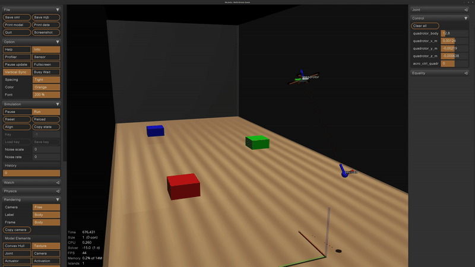

# ACP MuJoCo Payload Transportation Simulator Setup



At this point, you should have successfully installed all required **ACP Lab core packages**.


To use the **ACP MuJoCo Simulator** for payload transportation, we recommend creating a **dedicated ROS 2 workspace**:

```text
payload_transportation_ws
```

---

## Optional environment contacts in acro scenes

The acro launch files in `acp_autonomy` expose
`enable_environment_contacts:=true|false` (default `true`). Setting it to `false`
disables collisions with static environment geometry: floor, walls, ceiling,
boxes, pillars, and gates. Geometry remains visible; bodies can pass through it.
Contacts between moving bodies and tendon limits used for cables are unchanged.

```bash
ros2 launch acp_autonomy single_quadrotor_payload_nmpc_acro_simulation_mujoco.launch.py \
  quad_name:=eagle11 init_z:=1.5 payload_x:=0.0 payload_z:=0.5 \
  enable_environment_contacts:=false
```

The option is passed to the scene Xacro, which sets both `contype` and
`conaffinity` to zero for the `environment` geometry class. New static obstacles
should use `class="environment"` to follow this setting. Gates have explicit
contact masks, so the gate scene also sets its gate mask to zero when the option
is false. When true, the separate `gates_collide` option keeps its existing
meaning. No global contact or constraint disable flag is used.

This applies to the single quadrotor acro, payload, gate, and LiDAR scenes and
the multiple quadrotor point-mass scenes. It works with both the viewer and
headless executable because both load the generated MJCF model. No C++ parameter
or headless executable change is needed.

## 1. Create and Configure the Workspace

Create the workspace directory (the location is up to you) and export it as an environment variable.

### Edit your `~/.bashrc`

```bash
vim ~/.bashrc
```

Add the following line (adjust the path if needed):

```bash
export COLCON_WS_DIR="$HOME/payload_transportation_ws"
```

Reload your environment:

```bash
source ~/.bashrc
```

> **Note**
> `~/payload_transportation_ws` is only an example. Ensure this path matches the actual location of your workspace.

---

## 2. Create the Setup Script

Navigate to your workspace:

```bash
cd $COLCON_WS_DIR
```

Create a setup script:

```bash
vim setup_acp_payload_transportation_simulator.sh
```

Paste the following content:

```bash
#!/bin/bash
set -e

mkdir -p src
cd src

# Start SSH agent and add key
eval "$(ssh-agent -s)"
ssh-add ~/.ssh/id_ed25519

# ACP autonomy stack
if [ ! -d "acp-autonomy-stack" ]; then
  git clone git@github.com:acp-lab/acp-autonomy-stack.git
  pushd acp-autonomy-stack
  git checkout payload_transportation_simulator
  popd
fi

# Quadrotor control
if [ ! -d "acp-quadrotor-control" ]; then
  git clone git@github.com:acp-lab/acp-quadrotor-control.git
  pushd acp-quadrotor-control
  git checkout payload_transportation_simulator
  popd
fi

# DQ-NMPC
if [ ! -d "dq_nmpc" ]; then
  git clone git@github.com:acp-lab/dq_nmpc.git
  pushd dq_nmpc
  git checkout payload_transportation_simulator
  popd
fi

# Raspberry Pi ROS 2 interface
if [ ! -d "pi_ros2_interface" ]; then
  git clone git@github.com:acp-lab/pi_ros2_interface.git
  pushd pi_ros2_interface
  git checkout main
  popd
fi

# ACP MuJoCo simulator
if [ ! -d "acp_mujoco_simulator" ]; then
  git clone git@github.com:acp-lab/acp_mujoco_simulator.git
  pushd acp_mujoco_simulator
  git checkout payload_transportation_simulator
  popd
fi

cd ..

# Build workspace
source /opt/ros/humble/setup.bash
colcon build --symlink-install --cmake-args -DCMAKE_BUILD_TYPE=Release
source install/setup.bash
```

---

## 3. Make the Script Executable

```bash
chmod +x setup_acp_payload_transportation_simulator.sh
```

---

## 4. Run the Setup Script

From inside your workspace:

```bash
cd $COLCON_WS_DIR
source setup_acp_payload_transportation_simulator.sh
```

This will clone all required repositories and build the workspace.

---

## 5. Build DQ-NMPC (Base Controller)

To build and use **DQ-NMPC** as the base controller for payload transportation:

```bash
cd $COLCON_WS_DIR/src

# Clone dual-quaternion C++ library
git clone git@github.com:acp-lab/dq_cpp.git
cd dq_cpp
git checkout payload_transportation_simulator

# Build DQ-NMPC for onboard usage
cd $COLCON_WS_DIR/src/dq_nmpc
chmod +x build_dq_nmpc_onboard.sh
source build_dq_nmpc_onboard.sh
```

When prompted for the platform type, enter:

```text
eagle
```

> **Note**
> Ensure all dependencies are installed and that the `dq_nmpc` repository was cloned in the previous steps.

---

## 6. Install MuJoCo

We use the **latest stable MuJoCo version** available at the time of this project.

From inside your workspace:

```bash
cd $COLCON_WS_DIR
```

Download and extract MuJoCo:

```bash
curl -L -o mujoco-3.4.0-linux-x86_64.tar.gz \
https://github.com/google-deepmind/mujoco/releases/download/3.4.0/mujoco-3.4.0-linux-x86_64.tar.gz

tar -xzf mujoco-3.4.0-linux-x86_64.tar.gz
rm mujoco-3.4.0-linux-x86_64.tar.gz
```

Clone MuJoCo ROS utilities:

```bash
cd $COLCON_WS_DIR/src
git clone git@github.com:acp-lab/MujocoRosUtils.git
cd MujocoRosUtils
git checkout payload_transportation_simulator
```

Build the MuJoCo ROS utilities:

```bash
cd $COLCON_WS_DIR
colcon build \
  --packages-select mujoco_ros_utils \
  --cmake-args \
    -DCMAKE_BUILD_TYPE=RelWithDebInfo \
    -DMUJOCO_ROOT_DIR=$COLCON_WS_DIR/mujoco-3.4.0

source install/setup.bash
```

---

## 7. Run the Simulator

### Start the MuJoCo simulator

```bash
cd $COLCON_WS_DIR
source install/setup.bash
ros2 launch acp_autonomy single_quadrotor_mujoco_sim.launch.py
```

### Start MAV manager

```bash
ros2 run mav_manager mav_manager_service_exec
```

### Run trajectory manager tests

```bash
ros2 run mav_manager_test main_test
```

### Payload initial pose, physical parameters, and headless duration

The payload simulation launch accepts the quadrotor's initial position and
orientation, the payload's initial position, physical parameters, and an optional
headless duration:

```bash
ros2 launch acp_autonomy single_quadrotor_payload_nmpc_acro_simulation_mujoco.launch.py \
  quad_name:=eagle11 headless:=true duration_s:=20.0 \
  init_roll:=0.0 init_pitch:=0.0 \
  payload_x:=-0.7 payload_y:=0.0 payload_z:=0.02
```

| Argument | Default | Meaning |
|---|---|---|
| `init_x`, `init_y`, `init_z` | `0.0`, `0.0`, `0.03` | Quadrotor body-origin position in world coordinates, metres |
| `init_roll`, `init_pitch`, `init_yaw` | `0.0`, `0.0`, `0.0` | Initial quadrotor Euler angles, radians |
| `payload_x`, `payload_y`, `payload_z` | `-0.7`, `0.0`, `0.02` | Initial payload position in world coordinates, metres |
| `quadrotor_mass` | `1.24` | Quadrotor mass, kg |
| `quadrotor_ixx` | `0.0027338143976` | Quadrotor inertia about the body x-axis through its CoM, kg m² |
| `quadrotor_iyy` | `0.0027336327812` | Quadrotor inertia about the body y-axis through its CoM, kg m² |
| `quadrotor_izz` | `0.0052991944907` | Quadrotor inertia about the body z-axis through its CoM, kg m² |
| `payload_mass` | `0.2` | Mass of the cable-connected payload, kg |
| `cable_length` | `0.95` | Maximum tendon length between attachment sites, metres |
| `duration_s` | `0.0` | Headless simulation duration in simulated seconds; zero runs until stopped |

Pose and physical arguments apply to both graphical and headless runs. `duration_s` applies
only with `headless:=true` and must be finite and nonnegative. The simulator
stops at the first completed physics step reaching the requested duration, so
the endpoint has physics-timestep resolution. Existing launches that omit
`duration_s` continue running until stopped.

For example, to change the plant parameters:

```bash
ros2 launch acp_autonomy single_quadrotor_payload_nmpc_acro_simulation_mujoco.launch.py \
  quad_name:=eagle11 headless:=true duration_s:=20.0 \
  quadrotor_mass:=1.5 \
  quadrotor_ixx:=0.0035 quadrotor_iyy:=0.0035 quadrotor_izz:=0.006 \
  payload_mass:=0.3 cable_length:=1.2
```

The inertia remains diagonal: `diag(Ixx, Iyy, Izz)`. Mass and inertia are
independent inputs; changing `quadrotor_mass` does not rescale the inertia.
These arguments configure the MuJoCo plant. Controller model parameters remain
configured separately, so use matching values there for nominal-model experiments.
Changing `cable_length` sets the tendon limit; initial positions remain the values
supplied through the pose arguments.
